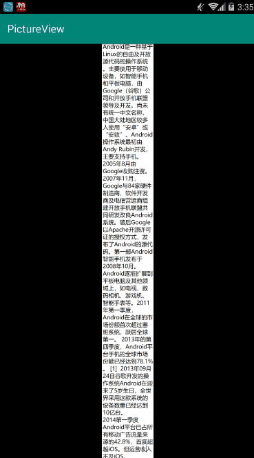
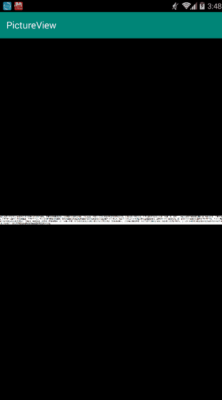

# PictureView
基于ImageView，支持图片放大缩小，支持长图


## 用法
* xml:
```xml
<tzy.pictureview.PictureView
    android:layout_width="match_parent"
    android:layout_height="match_parent"
    android:background="#000000"
    android:src="@mipmap/test" />
```
* java:
```java
PictureView pictureView = findViewById(R.id.picture_view);
pictureView.setImageResource(R.drawable.xxx);
```
## 纵向长图


## 横向长图


## 混淆
```
-keep class tzy.pictureview.PictureView$* {
    *;
}
```